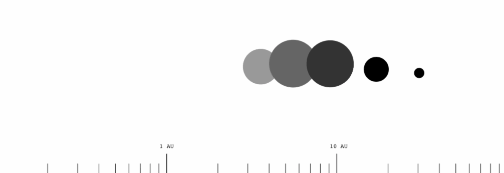

# ACCRETE v.1.0.0

### Planetary system creation simulation in the browser, or the server.

The codebase has been completely reimplemented from scratch in a form that more [**closely resembles that put forth in the original Dole paper**](http://www.rand.org/pubs/papers/2005/P4226.pdf).



### Usage

#### Building

```
$> npm install && npm build
```

#### Browser

```javascript
<script src="accrete.min.js" />;
const system = new Accrete.StarSystem();
system.create();

const planets = system.planets;
```

#### Node

```javascript
import Accrete from "Accrete";

const system = new Accrete.StarSystem();
system.create();
const planets = system.planets;
```

### Goals

- [x] Organize the codebase into a more modern, and JavaScript friendly structure.
- [x] A full build process for Browser/Node scripts and modules.
- [ ] Implement a good chunk of [StarGen's](http://www.eldacur.com/~brons/NerdCorner/StarGen/StarGen.html) features.
- [ ] Live WebGL view and screenshot options for created systems.
- [ ] Other cool things to take advantage of this amazing program.

### History of Ac(c)rete

Accrete.js is an implementation of the awesome planetary system simulation algorithm, [Accrete](http://www.rand.org/pubs/papers/P4226.html) in JavaScript. Originally published\* and partly programmed (via FORTRAN) by the amazing Stephen H. Dole. Almost a decade later Carl Sagan and Richard Isaacson refined Dole's model -- which shortly thereafter was also implemented in FORTRAN, and again elaborately and academically published by Martin Fogg in his paper ["Extra-Solar Planetary Systems"](https://www.academia.edu/4173808/Extra-Solar_Planetary_Systems_A_Microcomputer_Simulation).

The late 80's came and Matt Burdick brought this priceless program to the masses (via Turbo Pascal and C). Since then, many versions of _Accrete_ have popped up around the internet, adding varying degrees of planetary specifics – the most notable (and ingenious) being [Jim Burrow's](http://www.eldacur.com/~brons/) implementation [StarGen](http://www.eldacur.com/~brons/NerdCorner/StarGen/StarGen.html). [Ian Burrell's](http://znark.com/) [Java port](http://znark.com/create/accrete.html) is another great example (and was of great help on Accrete's previous implementation).

### THANK YOU

Obviously, this work could not have been completed without the following curious minds:

- Stephen H. Dole
- Carl Sagan
- Richard Isaacson
- Martin Fogg
- Matt Burdick
- Jim Burrow
- Ian Burrell
